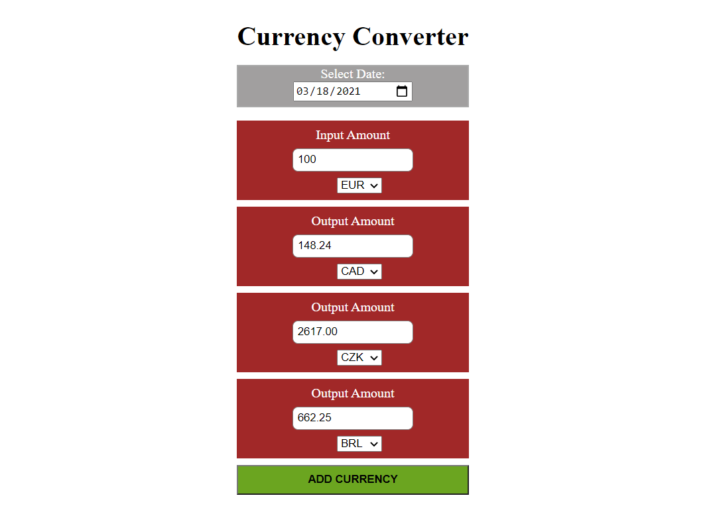

**Currency Converter** is an open source, self-hosted, currency converter app based on Exchangerates API

* [System requirements](#system-requirements)
* [Features](#features)

## System requirements

* Windows, Linux or Mac OS;

* NodeJS 14.15

* NPM 6.14;

## Features

* Choose currency that should be the source currency from list of currencies in dropdown;

* Enter amount which should be converted;

* Add currencies to which the conversion is to be made through an Add currency button;

* Choose currency that should be the target currency from list of currencies in dropdown;

* Revese conversion also possible, change the amount in any of the target currency boxes;

* Possible to apply conversion rate from any past date;
